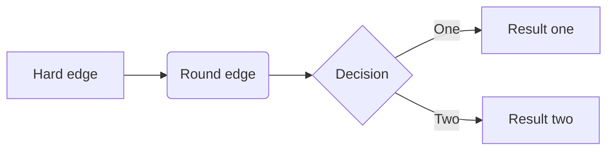

## Test 1 - code block

------

```javascript
// comment
var s = "JavaScript syntax highlighting";
alert(s);

```

## Test 2 - code block

```javascript
// comment
var s = "JavaScript syntax highlighting";
alert(s);
```

dsfsdfdsf dvsdv

| test1 | test2 |
| ----- | ----- |
| t1    | t2    |

> Some Markdown processors allow you to create *definition lists* of terms and their corresponding definitions. To create a definition list, type the term on the first line. On the next line, type a colon followed by a space and the definition.

1. sdcfsdf

2. dfsdf

3. dfsdf

   - [x] asdas

  - [x] sadsa

     `sadasd`
     kjabnkdjnaksjdn

-----------------------



